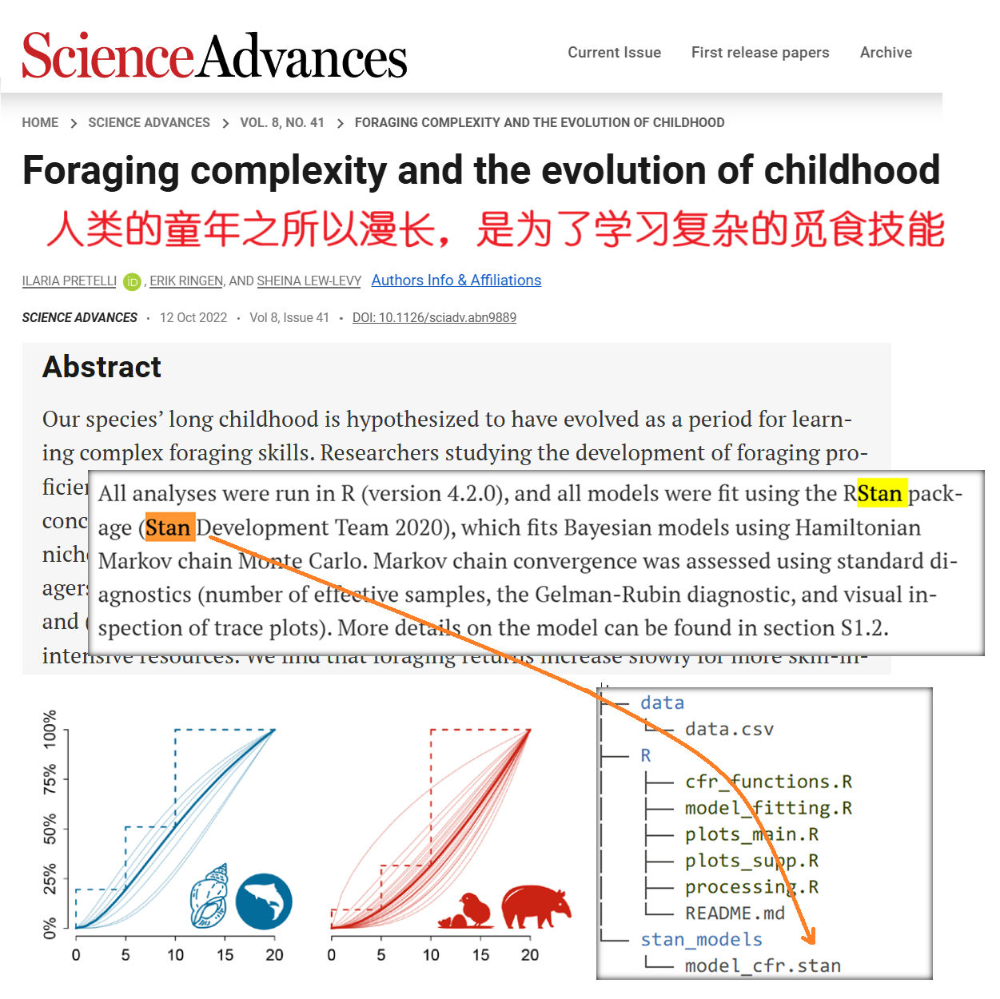
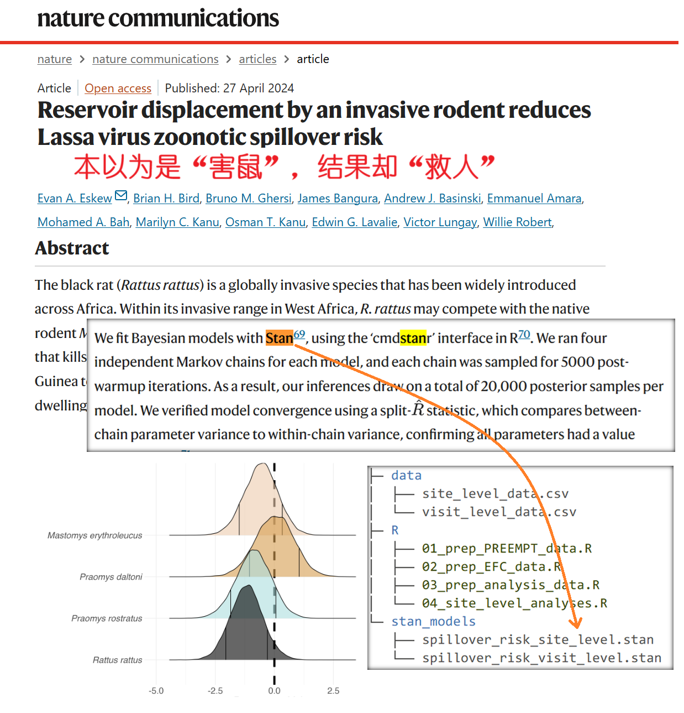
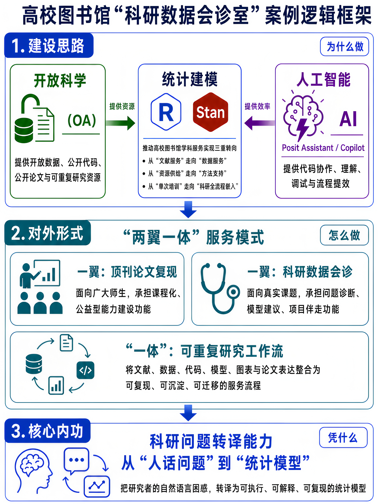

# 帮助研究者从“找到知识”到“生产可信知识”

## 项目说明

本仓库用于整理和保存本人投稿至 **2026年中国图书馆学会专业图书馆分会学术年会暨专业图书馆发展论坛学术论文及业务案例征集** 的业务案例材料。

案例题目为：

> **帮助研究者从“找到知识”到“生产可信知识”：高校图书馆“科研数据会诊室”的实践路径与能力重塑**


## 统计编程能力的服务转化

以 Nature、Science 等顶刊论文中的开放数据与分析代码为训练对象，将统计建模、AI 工具与可重复研究方法转化为图书馆科研数据服务能力，进而支持研究者从“找到知识”走向“生产可信知识”。

<p align="center">
  
  
</p>


<p align="center">
  
</p>

---

## 仓库内容

```text
.
├── README.md                  # 项目说明文件
├── manuscript.qmd             # 正文稿件
├── images/                    # 图示材料
├── tables/                    # 表格材料
├── case/                      # 典型会诊案例（方法论支撑材料，已脱敏）
├── references.bib             # 参考文献数据
├── custom-reference-doc.docx  # Word 输出样式文件
└── apa-7th-edition.csl        # APA 第 7 版参考文献格式样式
```


## 软件环境

复现本文档需要安装：

- R
- RStudio
- Quarto

在 R 中安装宏包：

```r
install.packages(c(
  "tidyverse",
  "readxl",
  "flextable",
  "officer",
  "knitr"
))
```


## 复现 Word 文档

用 RStudio 打开 `manuscript.qmd`，然后点击编辑器上方的 **Render** 按钮。

生成完成后，Word 文件会出现在当前工作目录中。

---

## 写在最后：从真实工作中长出来

这篇文字并不是一篇完成式的成果总结，也不想把一项仍在探索中的服务包装成某种成熟模式。它更像是一份持续生长的工作记录：记录了我在图书馆学科服务岗位上，如何把兴趣、能力、工具、课程、开放科学和真实需求一点点编织在一起，并逐渐转化为一种新的服务形态，更好地服务师生。

许多做法仍在探索中，也并不完美。之所以整理成文并提交会议，是希望通过交流获得更多批评指正和同行激励，也希望让这份持续多年的专业兴趣，能够在图书馆服务场景中走得更远、更扎实、更有价值。


