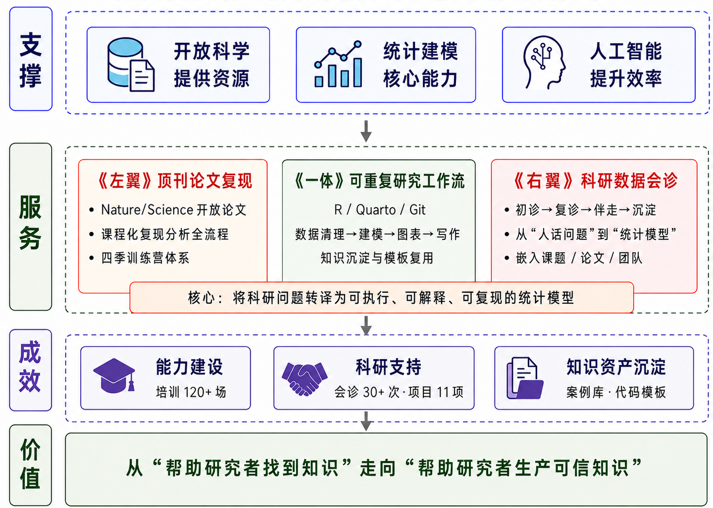

```{r}
#| label: setup
#| include: false

library(flextable)
library(readxl)
library(dplyr)

set_flextable_defaults(
  font.family = "宋体",
  font.size   = 10.5,
  theme_fun   = theme_box
)


fit_width_by_prop <- function(ft, prop, total_width = 6) {
  
  col_width <- total_width * prop / sum(prop)
  
  ft |>
    set_table_properties(layout = "fixed", align = "center") |>
    width(j = seq_along(prop), width = col_width)
}

# flextable(head(cars)) |>
#   fit_width_by_prop(
#     prop = c(1, 2),
#     total_width = 6.5
#   )
```


```{r}
#| label: load-tables
#| include: false

t1    <- read_excel("tables/table01.xlsx")
t2    <- read_excel("tables/table02.xlsx")
t3    <- read_excel("tables/table03.xlsx")
t4    <- read_excel("tables/table04.xlsx")
t_app <- read_excel("tables/table_app.xlsx")
```

# 摘要 {.unnumbered .unlisted}

在开放科学、人工智能与数据密集型科研快速发展的背景下，高校科研人员对图书馆学科服务的需求，正在从文献获取和资源利用，进一步延伸到数据组织、统计建模、结果解释与可重复研究支持。本文以四川师范大学图书馆“科研数据会诊室”为案例，探讨高校图书馆如何将开放科学资源、AI 协作工具与统计建模能力转化为面向真实科研问题的知识服务能力。案例实践表明，以开放科学提供资源、以人工智能提升效率、以统计建模形成核心能力，并通过“顶刊论文复现”和“科研数据会诊”两翼并进、可重复研究工作流贯穿其中的服务模式，能够推动图书馆学科服务从资源保障走向方法支持、过程协同与知识资产沉淀。该案例说明，在 AI for Science 与开放科学交汇的时代，高校图书馆的核心竞争力不再只是资源掌握能力，而是将文献、数据、工具、模型和研究问题重新组织为可信知识生产流程的能力。

**关键词：** 高校图书馆；开放科学；统计建模；学科服务；可重复研究；知识服务

# 案例背景：科研服务需求发生变化

近年来，开放科学理念持续深入，越来越多高水平期刊开始公开论文原始数据、分析代码和研究流程。对于高校科研人员而言，这不仅提高了研究透明度和可重复性，也为学习高水平研究方法提供了新的路径。研究者不再只能阅读论文结论，还可以进一步追踪一项研究如何提出问题、组织数据、建立模型、生成图表并完成论文写作。

与此同时，人工智能、数据科学和统计建模方法正在深刻改变科研生产方式。越来越多学科的研究问题，已经不再局限于简单描述统计、相关分析或普通回归，而是涉及多层级数据、纵向追踪数据、空间数据、潜变量、非线性关系、因果推断和不确定性表达等复杂情境。科研人员在真实研究过程中，常常面对的并不是“软件如何操作”的单一问题，而是“数据结构是否支持研究问题”“模型假设是否合理”“结果能解释到什么程度”“论文中如何规范表达”等综合性问题。

这意味着，高校科研人员对图书馆的需求已经从“找到文献”扩展到“理解文献背后的方法”，从“获取数据”扩展到“使用数据产生可信知识”，从“学习工具操作”扩展到“掌握可迁移的研究流程”。然而，当前不少高校图书馆学科服务仍以数据库资源介绍、文献检索培训、查收查引、投稿指导和学术评价支持为主，对于科研数据分析、统计建模、论文方法表达和可重复研究流程的支持相对不足。

在这一背景下，高校图书馆需要重新思考自身在科研生态中的位置。图书馆不只是知识资源的组织者和提供者，也应成为科研过程的协同者、方法能力的支持者和开放科学实践的推动者。特别是在开放科学背景下，图书馆可以利用顶刊开放数据、公开代码、开源软件和可重复研究流程，将外部优质科研资源转化为本校师生可学习、可模仿、可迁移的教学案例和咨询服务。

基于上述认识，四川师范大学图书馆学科服务部门尝试建设“科研数据会诊室”，探索面向科研全流程的数据分析与统计建模支持服务。

# 案例目标：从资源保障到方法支持

“科研数据会诊室”的建设目标，并不是简单增加一项数据分析咨询业务，而是以真实科研需求变化为牵引，推动图书馆学科服务从资源保障走向方法支持、过程协同和知识沉淀。

第一，从资源服务转向方法服务。传统学科服务强调资源发现与利用，例如数据库检索、文献获取、论文投稿和学术评价等。这些服务仍然重要，但已不足以支撑科研人员完成复杂研究任务。“科研数据会诊室”希望在资源服务基础上进一步延伸，帮助科研人员理解文献中的研究设计、数据组织、模型选择和结果解释，推动学科服务从“告诉读者在哪里找资源”转向“帮助读者如何使用数据和方法解决问题”。

第二，从一次性培训转向连续性能力建设。以往图书馆培训多为单场讲座，虽然能够提高资源知晓度，但难以持续提升科研人员的数据分析和统计建模能力。为此，本案例将培训课程化、系列化和品牌化，围绕科研绘图、统计建模、贝叶斯推断和 Stan 建模等主题，形成由浅入深、由工具到思想、由案例到迁移的学习路径。

第三，从通用指导转向嵌入式科研支持。科研人员的问题往往高度具体，无法仅靠通用讲座解决。不同学科的数据类型、研究设计、变量关系和论文表达方式存在较大差异。因此，“科研数据会诊室”强调以真实科研问题为入口，通过预约咨询、个案诊断、项目伴走等方式，嵌入教师课题、研究生论文和科研团队项目，提供更具针对性的支持。

由此，本案例试图回答一个核心问题：高校图书馆如何在开放科学与人工智能快速发展的背景下，将外部开放资源和智能工具转化为面向真实科研问题的统计建模支持能力，并进一步形成可教学、可培训、可会诊、可沉淀的知识服务体系？

# 实践设计与实施路径：构建“两翼一体”的服务模式

在实践设计上，“科研数据会诊室”的运行逻辑可概括为“支撑—服务—成效—价值”四个层次，如图 [-@fig-figure01] 所示。  首先，在支撑层，开放科学、统计建模与人工智能分别提供资源基础、核心方法能力和效率支撑；其次，在服务层，形成“顶刊论文复现”与“科研数据会诊”两翼并进、可重复研究工作流贯穿其中的“两翼一体”服务模式；再次，在成效层，逐步形成能力建设、科研支持和知识资产沉淀三类成果；最终，在价值层，推动图书馆知识服务从“帮助研究者找到知识”延伸至“帮助研究者生产可信知识”。

```{r}
#| label: fig-figure01
#| fig-cap: "高校图书馆“科研数据会诊室”案例逻辑框架"
#| out-width: "95%"
#| fig-align: center


```

其中，“两翼一体”是具体服务形式：一翼是面向广大师生的“顶刊论文复现”，通过开放数据、公开代码和顶刊案例开展课程化训练，承担公益型能力建设功能；一翼是面向真实课题的“科研数据会诊”，嵌入科研过程，承担问题诊断、模型建议、项目伴走功能；“一体”则是贯穿二者的可重复研究工作流。该模式的关键，并不只是提供代码或工具，而是将研究者的自然语言困惑转译为可判断的数据结构、可执行的建模方案和可解释的研究结果。

## 明确 AI、开放科学与统计建模的分工

在该案例中，开放科学、人工智能与统计建模并不是并列的三个概念，而是分别承担不同功能。开放科学提供真实、可追溯、可复用的研究材料；AI 协作工具提高代码生成、调试、文献整理和表达优化的效率；统计建模则提供判断研究问题、数据结构、模型假设和代码执行的核心框架。

因此，AI 并不替代会诊人员的专业判断。它可以帮助更快生成代码初稿、发现语法错误、整理分析流程或润色方法表达，但研究问题是否成立、变量关系如何理解、模型假设是否合理、结论能否支撑论文主张，仍需要由具备统计建模素养和跨学科沟通能力的服务人员把关。可以概括为：AI 解决“做得更快”，统计建模解决“做得是否合理”，可重复研究工作流解决“做完是否可信”。


## 以顶刊论文复现开展课程化训练

顶刊论文复现主要依托开放科学资源，选择 Nature、Science 及其他高水平期刊中公开数据和代码的论文作为教学案例，从真实论文中的研究问题开始，引导师生理解一项研究如何经历“问题提出—数据获取—变量构造—模型设定—结果可视化—论文表达”的完整过程。

在案例选择上，主要遵循三个标准：一是研究问题具有普遍启发性，能够跨学科迁移；二是数据和代码相对完整，便于复现；三是模型方法具有教学价值，例如混合模型、贝叶斯模型、时空模型、结构方程模型等。在此基础上，图书馆逐步形成“跟着 Nature 学”四季训练营课程体系，见表 [-@tbl-table01]。


```{r}
#| label: tbl-table01
#| tbl-cap: '"跟着 Nature 学"四季训练营设计'

flextable(t1) |>
  fit_width_by_prop(prop = c(1, 3, 5, 3)) |> 
  align(align = "left", part = "all") |>
  align(j = 1, align = "center", part = "all") |>
  bold(part = "header")
```

这一课程设计的主要目的是：让师生不只是“看懂论文”，而是通过复现论文的数据分析流程，理解顶刊研究背后的方法逻辑，并将其迁移到自己的研究中。

## 以真实科研问题开展数据会诊

与课程化训练相比，科研数据会诊更加注重个性化和场景化。教师、研究生或科研团队可以带着自己的数据、选题、假设或分析困惑进入会诊流程。会诊室首先帮助其澄清研究问题，再进一步判断数据类型、变量结构、样本规模、研究设计和可能适用的模型路径。

在实际服务中，许多科研问题最初都是以自然语言形式出现的。例如：“我的样本量很小，还能不能比较两组差异？”“我的数据来自多个医院、多个科室、多个时间点，如何判断政策是否有效？”“我的问卷变量存在潜变量和交互作用，应该怎样建模？”“我的解释变量可能存在内生性，如何处理？”

科研数据会诊室的关键工作，就是把这类“人话问题”翻译为“统计模型”，把模糊的研究困惑转化为可判断的数据结构、可执行的建模方案和可解释的结果表达。这种“问题转译”能力，是科研数据会诊室区别于普通软件培训的核心。表 [-@tbl-table02] 展示了会诊服务中较有代表性的转译情形。

```{r}
#| label: tbl-table02
#| tbl-cap: '会诊服务内容展示：从“人话问题”到统计建模方案（节选）'

flextable(t2) |>
  fit_width_by_prop(prop = c(1, 4, 6)) |> 
  align(align = "left", part = "all") |>
  align(j = 1, align = "center", part = "all") |>
  bold(part = "header")
```


在实施过程中，会诊室逐步形成“初诊—复诊—伴走—沉淀”的服务流程。“初诊”阶段主要澄清研究目的、数据来源、变量含义、样本结构和预期论文表达；“复诊”阶段进一步讨论模型方案、代码实现和初步结果；“伴走”阶段根据项目需要，参与数据清理、模型调整、结果解释、图形优化和论文方法部分写作；“沉淀”阶段则将具有共性的咨询问题整理为培训案例、代码模板或服务指南。

## 以可重复研究工作流实现服务沉淀

为了避免咨询服务停留在一次性答疑层面，本案例强调通过可重复研究工作流实现知识沉淀。每一次会诊不仅产出一套分析结果，还尽量形成可复用的项目文件夹、数据清理脚本、模型代码、图形代码、结果解释模板和方法写作说明。

在工具层面，服务过程中主要使用 R、RMarkdown 或 Quarto、dplyr、brms、lavaan、ggplot2、marginaleffects 等开源软件工具，鼓励研究人员将数据处理、统计建模、图表生成和论文结果整理纳入同一套可追溯流程。这样，图书馆提供的就不只是一个“结论”，而是一套可以复现、可以修改、可以复用的分析路径。


通过这一设计，“科研数据会诊室”逐步形成从开放资源转化、课程训练、个案咨询到知识资产沉淀的服务闭环。由顶刊论文复现形成的课程案例、由科研数据会诊形成的真实问题、由可重复研究工作流形成的代码与模板，又进一步反哺后续培训和服务，推动图书馆学科服务从外围支持走向科研过程内部。

# 典型会诊案例：从模糊研究困惑到可执行模型方案

这里选取我校商学院教师团队关于心理授权与创新绩效的研究。研究者最初的困惑并不是“某个软件如何操作”，而是：问卷中存在多个潜在概念，研究假设涉及中介和调节关系，样本量并不十分充足，如何判断模型是否合适、结果如何表达。

在初诊阶段，我首先帮助研究者梳理理论框架和变量关系，将原本较为笼统的表述拆分为三个问题：第一，量表题项能否支持潜变量测量；第二，核心自变量、因变量、中介变量和调节变量之间的路径关系是否具有理论依据；第三，样本量和题项质量是否足以支撑较复杂的结构方程模型。

在复诊阶段，我建议先进行量表信度、验证性因子分析和模型识别检查，而不是直接进入复杂路径模型；在此基础上，再根据理论假设逐步比较简单中介模型、调节模型和调节中介模型。

在伴走阶段，主要是整理代码、量表检查和图表建议。最终产出不是单一的统计结果，而是一套可追溯的分析流程。会诊过程也推动了我的持续学习，我发现潜变量交互、非正态题项和小样本估计不稳定等问题，贝叶斯结构方程模型才是更合适的解决方案。


# 服务成效：能力提升、科研支持与知识资产沉淀

经过持续实践，“科研数据会诊室”在师生能力提升、科研项目支持和图书馆服务转型方面取得了一定成效。总体来看，成效主要体现在能力建设、个案服务、项目支持和知识沉淀四个方面，见表 [-@tbl-table03]。

```{r}
#| label: tbl-table03
#| tbl-cap: '"科研数据会诊室"实践成效'

flextable(t3) |>
  fit_width_by_prop(prop = c(2, 4, 4)) |> 
  align(align = "left", part = "all") |>
  align(j = 1, align = "center", part = "all") |>
  bold(part = "header")
```

首先，提升了师生的数据分析与统计建模意识。通过训练营和会诊服务，部分师生开始从“套用统计方法”转向“理解数据生成机制”，从“只要软件输出结果”转向“理解模型假设和结果解释边界”。这种变化有助于提高科研分析的规范性、透明度和可信度。

其次，增强了图书馆嵌入科研过程的能力。传统学科服务多发生在论文写作前后的某个环节，而“科研数据会诊室”使图书馆能够进入研究设计、数据分析和结果表达等更核心的科研环节。从外围支持到深度嵌入，拓展了图书馆的角色边界。部分科研数据伴走服务情况如表 [-@tbl-table04] 所示。

```{r}
#| label: tbl-table04
#| tbl-cap: "科研数据伴走服务及支持类型（部分）"

flextable(t4) |>
  # set_header_labels(
  #   编号 = "编号",
  #   `学院 / 单位` = "学院 / 单位",
  #   研究主题 = "研究主题",
  #   支持类型 = "支持类型"
  # ) |>

  fit_width_by_prop(prop = c(1, 3, 4, 4)) |> 
  align(align = "left", part = "all") |>
  align(j = 1, align = "center", part = "all") |>
  bold(part = "header")
```

再次，形成了一批可复用的知识资产。在服务过程中积累的课程讲义、案例数据、代码模板、模型解释材料和论文方法表达框架，逐渐构成图书馆数据分析服务资源库。这些材料既可以用于后续教学和培训，也可以用于咨询服务和学科服务人员能力培养。

最后，推动了图书馆学科服务品牌化和产品化建设。以“跟着 Nature 学”训练营和“科研数据会诊室”为抓手，图书馆将零散的数据分析咨询转化为可识别、可传播、可持续的服务品牌。相比单次讲座，品牌化服务更容易形成读者认知，也更有利于争取学院、科研团队和管理部门的支持。

# 经验总结：高校图书馆学科服务的核心能力重塑

对高校图书馆而言，未来学科服务的核心竞争力，可能不再只是资源掌握能力，而是将资源、数据、工具和研究问题重新组织为可信知识生产流程的能力。统计建模正是连接研究问题、数据结构、方法选择和论文表达的关键中介。从本案例来看，“科研数据会诊室”对图书馆学科服务核心能力的重塑，主要体现在以下五个方面。

## 重塑开放科学资源转译能力

开放科学为图书馆提供了新的服务入口。过去，图书馆主要帮助读者发现和获取文献；现在，图书馆还可以帮助读者发现、理解和复用开放数据与开放代码。开放科学资源本身并不会自动转化为科研能力，图书馆需要发挥资源组织和教育转化优势，将顶刊论文中的数据、代码和分析流程转化为可教学、可复现、可迁移的本地案例。

## 重塑科研问题建模能力

科研数据会诊的关键，不在于掌握某一个软件，而在于能够理解研究者的问题，并将其转化为合适的数据结构和模型框架。对于图书馆学科服务人员而言，未来需要具备一定的数据素养、统计建模素养和跨学科沟通能力，能够在研究问题、数据类型、模型假设和论文表达之间建立联系。

## 重塑可重复研究组织能力

可重复研究是开放科学的重要组成部分。图书馆可以通过项目文件规范、数据管理、代码组织、版本记录和结果归档等方式，帮助科研人员建立更加规范的研究流程。“科研数据会诊室”如果能够将每一次咨询沉淀为可复用模板，就能从个案服务走向知识资产建设。

## 重塑跨学科协同能力

高校科研问题高度多样，单一学科背景很难覆盖所有需求。图书馆学科服务人员虽然未必成为每个学科的专家，但可以成为研究者、数据、模型和工具之间的连接者。通过“问题转译”，图书馆能够在不同学科之间搭建沟通桥梁，帮助研究者把模糊问题转化为可分析问题，把经验判断转化为模型表达。

## 重塑服务产品化能力

可持续的学科服务不能仅依靠个人热情和零散咨询，而应逐渐形成服务产品。训练营、会诊室、案例库、模板库、服务指南和预约机制，都是服务产品化的重要形式。通过产品化设计，图书馆可以提高服务识别度、稳定性和可复制性，也有助于向学校管理层和学院展示服务价值，并为未来探索项目化、定制化和持续性科研支持服务奠定基础。

总体而言，“科研数据会诊室”的经验表明，高校图书馆学科服务的能力重塑，并不是简单引入新工具，也不是单纯增加培训场次，而是围绕真实科研问题重新组织资源、数据、工具、模型和表达方式。其核心，是把开放科学资源转化为本地能力，把 AI 协作工具转化为效率支撑，把统计建模能力转化为科研过程协同能力。

# 结语

“科研数据会诊室”的实践表明，在开放科学与 AI for Science 时代，高校图书馆完全有能力依托资源组织、学科联络和用户教育优势，将外部开放资源、智能工具和统计建模方法转化为内部核心能力，主动嵌入科研全流程，为可信知识生产提供支撑。

从更深层次看，图书馆知识服务的价值正在从“帮助研究者找到知识”延伸为“帮助研究者生产可信知识”。这也意味着，高校图书馆学科服务的未来方向，不应停留在资源供给和工具培训，而应进一步走向方法支持、过程协同和知识创造。

“科研数据会诊室”只是这一转型路径中的一种探索。未来，还可以进一步完善服务台账和效果评价机制，建设跨学科专家协同网络，形成更多标准化案例模板和 AI 辅助会诊流程，并与学校科研管理、研究生培养和学院学科建设深度结合。通过持续积累，高校图书馆有望在开放科学背景下形成具有自身特色的科研支持体系，为学校科研创新和人才培养提供更加深入、前瞻和不可替代的知识服务支撑。



# 支撑材料 {.unnumbered}

```{r}
#| label: tbl-app
#| tbl-cap: "支撑材料清单"

flextable(t_app) |>
  fit_width_by_prop(prop = c(1, 3, 6)) |>
  align(align = "left", part = "all") |>
  align(j = 1, align = "center", part = "all") |>
  bold(part = "header") #|> 
 #  compose(
 #    j = "链接",
 #    value = as_paragraph(
 #      hyperlink_text(
 #        x   = 链接,
 #        url = 链接
 #     )
 #   )
 # )
```

